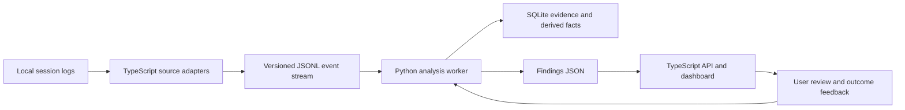

# Poe reasoning and efficiency analytics

Status: architecture baseline for implementation

## Purpose

Poe should reconstruct what an assistant was asked to do, how its observable work progressed,
what resources it consumed, and whether the result was useful. Every conclusion must link back
to recorded evidence. Missing data must remain missing rather than becoming an estimate presented
as fact.

The system is local and read-only. Deterministic analysis must not call a model or consume model
tokens. A future semantic model may be optional, but its output must be labeled separately from
facts derived from logs.

## What Poe can and cannot observe

Poe can observe data that a client records, including user requests, assistant messages, tool calls,
tool results, timestamps, model identifiers, configured reasoning effort, token counters, file
references, edits, tests, and some reasoning or thinking blocks.

Poe cannot recover private chain of thought that was never written to a log. It also cannot decrypt
encrypted reasoning. A reasoning summary, visible thinking block, or recorded analysis message is
evidence about the trajectory, but it is not guaranteed to be the model's complete internal
reasoning.

These limits create three evidence classes:

| Class | Meaning | Examples |
|---|---|---|
| Recorded fact | Directly present in a source log | token counter, tool exit code, timestamp |
| Derived fact | Deterministic transformation of recorded facts | repeated call signature, elapsed time |
| Interpretation | A rule or model judgment that can be wrong | unnecessary reread, weak plan, stale assumption |

The dashboard must show the evidence class and confidence for every finding.

## Architecture decision

Use TypeScript for collection and product integration, and Python for analysis.

The existing TypeScript parsers already understand Codex, Claude Code, VS Code chat, and Copilot
CLI logs. TypeScript also serves the dashboard and MCP interface. Rewriting those parsers in Python
would duplicate security checks, incremental parsing, source semantics, and test fixtures.

Python is a better fit for feature extraction, sequence analysis, cohort comparisons, statistics,
and future local machine-learning experiments. It should receive one versioned event format instead
of learning every vendor log format.

The Python worker runs as a child process, accepts local data through standard input or a temporary
JSONL file, and returns structured JSON. The dashboard remains usable if Python is missing: source
collection and current deterministic findings continue to work, while advanced analysis clearly
reports that it is unavailable.

No Python package is required for the first implementation. The standard library provides JSON,
SQLite, statistics, subprocess control, and date handling. Packages can be evaluated later only
when a measured requirement justifies them.

## System boundaries

### TypeScript collector

Responsibilities:

- discover enabled sources without following links outside configured roots;
- parse each vendor format and preserve its token semantics;
- assign stable source, session, turn, message, reasoning, and tool-event identifiers;
- redact secrets before any optional preview is persisted;
- write a versioned, append-safe JSONL snapshot;
- launch and supervise the Python worker outside the dashboard request path;
- validate the worker response before showing it.

It must not decide that an action was wasteful merely because it was long or repeated.

### Python analysis worker

Responsibilities:

- validate the event schema and record coverage gaps;
- reconstruct task contracts and observable work trajectories;
- calculate token, time, tool, retry, context, and outcome features;
- compare like tasks with like tasks;
- run deterministic finding rules with explicit evidence requirements;
- track finding confidence, lifecycle, and review feedback;
- return compact data prepared for the dashboard.

It must not modify session logs, run project commands, or contact a remote service.

### Dashboard and MCP

Responsibilities:

- separate facts from interpretations;
- show source coverage and missing evidence before findings;
- allow inspection from a finding to its sessions, turns, and events;
- show current activity separately from historical context;
- record whether a finding was useful, expected, incorrect, or deferred;
- expose structured evidence to Codex or Claude Code without automatically prompting either one.

MCP is an interface to Poe's local data and review actions. It is not a skill and does not by itself
consume model tokens. Tokens are consumed only when an assistant is asked to call the MCP tools and
process their results.

## Versioned event model

Every record needs `schemaVersion`, `eventId`, `eventType`, `source`, `sessionId`, `timestamp`, and
`provenance`. Provenance contains the source file fingerprint and parser version, but the dashboard
does not expose raw local paths unless requested.

The normalized dataset contains these record types:

1. `source_snapshot`: enabled source, root status, scan time, parser version, file counts, warnings.
2. `session`: harness, project, launcher, start, last activity, end state, parent or subagent link.
3. `turn`: user request, assistant response, model, mode, cancellation, elapsed time, work type.
4. `instruction`: origin, scope, precedence, hash, size, and whether it was actually loaded.
5. `reasoning_event`: recorded type, hash, length, time, turn, and optional redacted preview.
6. `tool_call`: tool family, normalized signature, time, status, duration, error category, and result hash.
7. `token_usage`: provider-reported counters, counter scope, cache fields, reasoning tokens, and coverage.
8. `artifact_change`: file or external artifact changed, operation type, revert status, and related turn.
9. `verification`: check or test performed, result, scope, and the change it validates.
10. `task_outcome`: completion evidence, unresolved items, user correction, acceptance, or abandonment.
11. `finding`: rule version, evidence references, confidence, impact, recommended action, and status.
12. `finding_review`: user decision, reason, timestamp, and later measured outcome.

Content has three local privacy modes:

- `metadata`: hashes, sizes, counters, and categories only;
- `preview`: short secret-redacted excerpts for review;
- `transient`: full text may enter the Python process for local analysis but is never persisted.

`metadata` remains the default. Analysis that requires text must say it is unavailable when the mode
does not provide it.

## Reconstructing the task

For each user turn, Poe builds a task contract from recorded evidence:

- requested outcome and deliverable;
- acceptance or success criteria;
- explicit constraints and prohibited actions;
- files, systems, people, or projects in scope;
- authorization to read, edit, execute, publish, or communicate;
- requested level of explanation and response shape;
- urgency, risk, and whether current information is required;
- unresolved ambiguity and questions asked;
- changes introduced by follow-up prompts;
- completion signals and remaining work.

The contract is versioned by turn. A later correction supersedes only the affected fields; it does
not erase the earlier state. Poe can then distinguish a justified course change from a loop.

Text-free metadata cannot fully reconstruct a task contract. Under `metadata` mode, Poe reports only
structural observations such as number of turns, tool sequence, errors, and token coverage.

## Reconstructing observable reasoning

Poe represents the work as a directed trajectory of events rather than a single reasoning score.
It looks for:

- initial plan or direct action;
- hypotheses and assumptions stated in recorded reasoning;
- evidence gathered for each decision;
- tool choice and whether the result was used;
- changes in direction after new evidence;
- retries with identical inputs;
- retries with changed inputs and a stated reason;
- repeated planning without action;
- contradictions between plan, action, and final answer;
- verification before completion;
- unresolved uncertainty that disappears from the final answer;
- progress after each costly action;
- stopping when the success criteria are met.

An identical event is not automatically a loop. Streaming duplicates, polling, retries after a
state change, idempotent checks, and required verification must be recognized first. A loop finding
requires repeated behavior, no new evidence, no state change, and no measurable progress.

Poe must not publish an "intelligence score." A single score would hide missing data and mix speed,
cost, correctness, and style. The dashboard instead shows separate dimensions with evidence.

## Token and context accounting

Token counters retain the provider's original meaning. Each counter records:

- provider and harness;
- model identifier;
- input, output, cache read, cache write, and reasoning tokens when exposed;
- whether the counter covers a request, agentic round, turn, session, or account window;
- whether it is authoritative, partial, inferred, or missing;
- the source event and parser rule used;
- whether retries, tool schemas, images, or server-side tools are included;
- whether reasoning tokens are a subset of output tokens;
- whether the request completed, failed, was cancelled, or is still active.

Poe must not add counters with different scopes. For example, a final-round input count cannot be
presented as cumulative session input. Account usage limits also cannot be reconstructed reliably
from local token totals unless the provider exposes the limit policy and current window state.

Useful token views include:

- coverage by harness and model before totals;
- input, output, cache read, cache write, and recorded reasoning over time;
- context growth within a session;
- cache effectiveness when both numerator and denominator are known;
- tokens spent before the first successful action;
- tokens associated with failed or repeated actions;
- tokens associated with verification;
- tokens per accepted task or validated change;
- distribution by task type, model, reasoning effort, project, and session outcome;
- current provider limit-window data only when directly reported by that provider.

Token volume alone is not waste. The closest useful efficiency measure is resources per validated
outcome, with task complexity and evidence coverage shown beside it.

## Analysis dimensions

### Source and coverage

- Which clients, versions, projects, and dates are represented?
- Are sessions active, closed, aborted, duplicated, or partially parsed?
- Which fields are absent because the source does not record them?
- Were events dropped because of retention or parser limits?
- Did local clock, time zone, or future timestamps affect the window?
- Are programmatic and interactive sessions separated?
- Are parent agents and subagents double-counted?

### Task understanding

- Did the assistant identify the requested outcome, constraints, and definition of done?
- Did it ask a necessary question or ask for information it could inspect itself?
- Did it continue after steering without losing the original goal?
- Did it treat transcript text, tool output, or attached documents as instructions?
- Did it expand the scope without authorization?
- Did it stop at a plan when implementation was requested?

### Context and memory

- Which instructions, skills, memories, files, and documents were actually loaded?
- How much context was static, dynamic, cached, repeated, stale, or unused?
- Were the same files reread after no relevant change?
- Did compaction or a resumed session lose accepted constraints?
- Was old historical behavior used as current evidence?
- Did memory prevent work, cause stale assumptions, or reduce rediscovery?
- Did a skill reduce retries or merely add instructions?

### Tool use and execution

- Were tools selected for the task and used in the right order?
- Were independent reads batched or repeated serially?
- Did a failed call produce a diagnostic change before retry?
- Were permissions, missing paths, timeouts, tests, and network failures separated?
- Was polling proportional to expected completion time?
- Were large tool outputs consumed, ignored, or requested again?
- Were side effects authorized, reversible, and verified?
- Did subagents create useful parallel progress or duplicate context and work?

### Reasoning trajectory

- Did the plan become more specific as evidence arrived?
- Were assumptions tested before dependent changes?
- Did the assistant commit to a viable approach or repeatedly reopen settled choices?
- Did it notice contradictory evidence?
- Was effort adjusted to task difficulty?
- Did the reasoning repeat because of log streaming, compaction, or an actual loop?
- Did the final explanation match the actions and observed results?

### Output quality

- Did the final response answer the current request?
- Were claims tied to checks, files, commands, or sources?
- Were limitations and missing evidence stated accurately?
- Was required code or documentation complete?
- Were findings repeated across an executive summary, body, and action list?
- Did length come from necessary detail, generated artifacts, or avoidable repetition?
- Was the user forced to ask whether the work was done?

### Outcome and rework

- Did required checks pass?
- Did the user accept, correct, reject, or redo the work?
- Were changes reverted or rewritten soon afterward?
- How long and how many turns passed before a usable result?
- Which failures were recovered from, and at what cost?
- Did the proposed intervention improve the next comparable task?

### Pattern validity

- Is the comparison within one task, across sessions, or across projects?
- Are compared tasks similar enough in type, complexity, model, and tooling?
- Is evidence recent enough to affect a current recommendation?
- Does older data provide context without setting the current baseline?
- Is the sample size sufficient, and is its uncertainty shown?
- Is repetition intentional, required, or a client logging artifact?
- Has the user previously marked this pattern useful or incorrect?

### Privacy and security

- Does a preview contain credentials, personal data, source code, or private paths?
- Can raw text remain transient while derived features are stored?
- Can the user inspect and delete Poe's local database?
- Are source roots allowlisted and symbolic links contained?
- Are imported logs treated as untrusted data?
- Can a malformed log cause excessive memory, disk, or CPU use?
- Are schema migrations reversible and backups bounded?

### Product behavior

- Does an empty state mean no matching rule, no data, stale data, or a failed scan?
- Can every recommendation be acted on without copying a large generic prompt?
- Does Poe make safe local decisions automatically when confidence is high?
- Does it ask for review when a durable preference or skill would change future behavior?
- Does the dashboard prioritize recent, high-impact, well-supported findings?
- Can the user see what changed after accepting a recommendation?

## Finding contract

Every finding contains:

- a concrete title and affected behavior;
- observation window and last occurrence;
- evidence class and confidence;
- affected sessions, turns, and event identifiers;
- data coverage and known blind spots;
- estimated impact expressed in measured units;
- a small proposed change;
- a validation method and comparison period;
- safety or quality conditions that must remain true;
- lifecycle: new, reviewed, accepted, applied, measuring, effective, ineffective, dismissed.

Poe does not claim saved tokens before and after comparable measurements exist. Before measurement,
it may report an opportunity such as "eleven failed calls carried 42,000 recorded input tokens," but
must not claim all 42,000 tokens were avoidable.

## Initial deterministic rules

The first Python rules should be narrow enough to validate against real examples:

1. Repeated identical failed call with no intervening state change.
2. Changed retries that continue to fail for the same bounded error category.
3. Repeated read of an unchanged file within one task.
4. Tool result requested again before the previous result was used.
5. Required verification omitted after a recorded code change.
6. Final completion claim contradicted by a failed required check.
7. User correction that restates an earlier explicit constraint.
8. Long response with duplicate sections or repeated finding text.
9. Context growth and cache coverage reported without labeling partial counters.
10. Skill candidate supported by repeated procedure, similar task type, and successful outcomes.

Each rule needs positive, negative, missing-data, duplicated-event, and boundary fixtures.

## Real-time sequence

1. The TypeScript collector incrementally parses appended log records.
2. It emits only new or changed normalized events.
3. The Python worker updates its local SQLite tables in one transaction.
4. Cheap session-local rules run immediately.
5. Cross-session rules run after the task closes or on a low-frequency schedule.
6. Findings are merged by stable identity and updated rather than duplicated.
7. The dashboard receives a compact change set.
8. User review becomes new evidence for thresholds and suppression, without changing raw history.

The target is a visible update within one refresh interval without blocking collection or the web
server. If analysis falls behind, Poe reports its analysis watermark and continues from the last
committed event.

## Failure and recovery

- A malformed record is quarantined with a bounded diagnostic; the remaining file continues.
- A Python crash leaves the last committed analysis intact and is retried with backoff.
- A schema mismatch stops advanced analysis and shows the exact incompatible versions.
- A partial JSONL snapshot is ignored until its atomic rename completes.
- A database migration writes a backup and can roll back.
- Source disappearance changes source status but does not silently delete history.
- Clock anomalies are flagged and excluded from recency decisions.
- Large sessions use streaming ingestion and bounded content buffers.

## Validation plan

Build a labeled set from real sessions only after removing secrets. For each rule, record whether the
behavior occurred, whether it harmed progress, and whether the proposed change would have helped.

Measure:

- precision before expanding rule coverage;
- false positives by harness, model, and task type;
- detection latency;
- parser and token-field coverage;
- analysis CPU, memory, and database growth;
- accepted findings that later improved retries, elapsed time, token use, or outcome quality;
- regressions where a cheaper workflow reduced correctness or verification.

The first release should prefer fewer useful findings over many speculative ones.

## Implementation slices

### Slice 1: evidence export and audit

- add `src/core/analysis-dataset.ts` for the versioned records;
- extend `src/core/efficiency-scan.ts` and `src/core/parse-worker.ts` to emit the dataset off-thread;
- add source semantics and coverage for every token field;
- validate stable identifiers and duplicate handling with fixtures;
- add an Evidence coverage view before introducing new advice.

### Slice 2: Python worker

- add `analysis/poe_analysis.py` using the Python standard library;
- ingest JSONL into a local SQLite database;
- implement the first five session-local rules;
- return validated finding JSON to the TypeScript service;
- expose worker status, watermark, duration, and errors.

### Slice 3: task and outcome reconstruction

- add transient text analysis and a task-contract representation;
- connect changes, checks, final claims, and user corrections;
- implement outcome-aware efficiency measures;
- keep semantic interpretations reviewable and confidence-labeled.

### Slice 4: comparative learning

- compare similar tasks across recent sessions;
- measure accepted interventions against a baseline;
- suggest skills or memory only after repeated successful evidence;
- add optional local-model analysis as a separate evidence source.

## Acceptance criteria for the first working system

- Every finding opens its exact source events.
- Missing reasoning or token data is visible and never imputed as fact.
- Codex and Claude Code token totals retain their original counter scopes.
- Current findings use at most five days; older sessions are historical context only.
- No deterministic scan invokes Codex, Claude, or any remote model.
- A repeated event produces one updated finding rather than duplicate cards.
- False-positive review suppresses that rule-instance and remains reversible.
- Parsing and analysis stay off the dashboard process's main execution path.
- The app remains useful when Python is absent or the worker fails.
- Tests demonstrate that required verification is not labeled waste.

## Decisions still requiring measured evidence

- how long derived event history should be retained;
- whether transient full-text analysis provides enough value over previews;
- which task taxonomy produces stable comparisons;
- whether a local embedding or language model improves precision enough to justify its footprint;
- how Codex and Claude subscription limit windows can be read without inferring them from tokens;
- which provider and client versions expose reliable reasoning-token counters;
- what minimum sample and confidence should permit an automatic recommendation;
- which accepted changes Poe may apply automatically and which require review.
